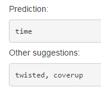

Data Science Capstone Project 
========================================================
author: dguedo
date: April 22th, 2016

Data Science Specialization  
Johns Hopkins University

Word Prediction 
========================================================
*A data product for predicting the next word*

The goal of this project was to create a data product to highlight a simple word prediction algorithm that could be accessed by others. 

The dataset used to build the corpus was provided by [swiftkey](https://swiftkey.com/en), and can be downloaded from here:
- https://d396qusza40orc.cloudfront.net/dsscapstone/dataset/Coursera-SwiftKey.zip

Included are three different data files containing text sampled from blogs, news articles, and twitter feeds. The English versions was used.

How it works
========================================================
At the heart of the prediction algorithm is an n-gram model (a type of probabilistic language model for predicting the next word). 

But in order to be able to predict the next word with the highest degree of accuracy, in a reasonably efficient manner, the data set needed to be cleaned up. Numbers, punctuation, and special characters were removed.  As well samples of the data sets are used to reduce the memory footprint.

I created four n-gram models (unigram, bigram, trigram, and four-gram) and transformed them into a dictionaries with their respective frequencies.  Then I implemented a simple Back-off algorithm that would "back-off" to the lower order n-gram models under certain conditions, such as no results or too few. 

How to use it
========================================================
<small>My shinny applications is, hopefully, quite straightforward to use.  Simply input a phrase (multiple words) into the text-box and click the submit button.</small>

<small>In the results pane, the application will display a prediction for the next word in your sentence, along with two different variants. For reference see the screenshot below.</small>

Additional Information
========================================================
- You can find the application here: https://dguedo.shinyapps.io/CapstoneProject/
- This presentation can be found here: http://rpubs.com/dguedo/Capstone

Thank you and I hope you enjoyed doing this specialization as much as I have!

